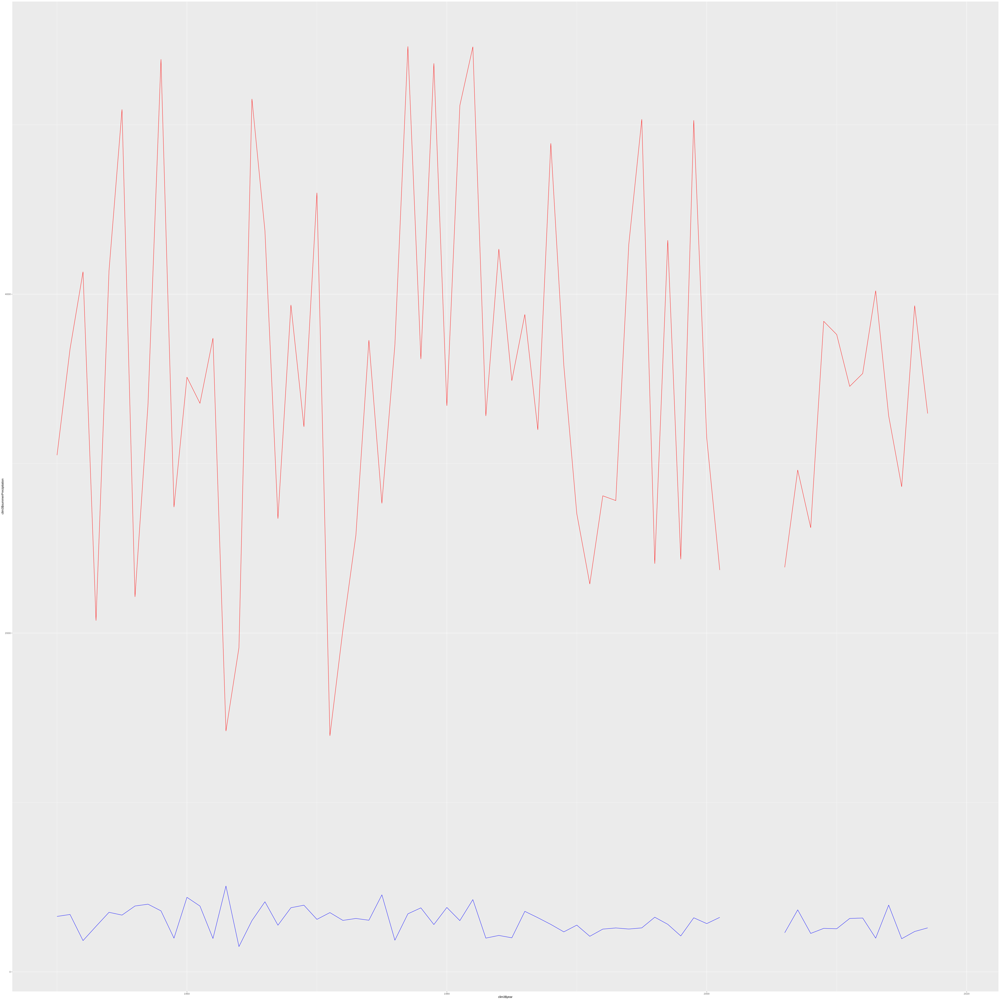

# Import packag


```r
#install.packages("rdwd")   # 
require("rdwd")
```

```
## Loading required package: rdwd
```

```r
require("berryFunctions")
```

```
## Loading required package: berryFunctions
```

```r
require("pbapply")
```

```
## Loading required package: pbapply
```

```r
require("lubridate")
```

```
## Loading required package: lubridate
```

```
## 
## Attaching package: 'lubridate'
```

```
## The following objects are masked from 'package:base':
## 
##     date, intersect, setdiff, union
```

```r
require("dplyr")
```

```
## Loading required package: dplyr
```

```
## 
## Attaching package: 'dplyr'
```

```
## The following object is masked from 'package:berryFunctions':
## 
##     between
```

```
## The following objects are masked from 'package:stats':
## 
##     filter, lag
```

```
## The following objects are masked from 'package:base':
## 
##     intersect, setdiff, setequal, union
```

## Add functions for adding indices


## DWD Import


```r
read_dwd_daily_period <- function(station, period) {
# select a dataset (e.g. last year's daily climate data from Potsdam city):
# daily climate data for recent and historical time period
  link <- selectDWD(station, res="daily", var="kl", per=period)
  file <- dataDWD(link, read=FALSE)
  climData1 <- readDWD(file, varnames=TRUE)
  #
  if (1>2) {
    link <- selectDWD(station, res="daily", var="weather_phenomena", per=period)
    file <- dataDWD(link, read=FALSE)
    climData2 <- readDWD(file, varnames=TRUE) 
    climData <- merge(climData1, climData2, by.x="MESS_DATUM", by.y="MESS_DATUM")
} else {
    climData <- climData1
  }
  
  return(climData)
}

read_dwd_daily <- function(station) {
  climHist <- read_dwd_daily_period(station, "recent")
  climRecent <- read_dwd_daily_period(station, "historical")
  climData <- rbind(climHist, climRecent)
  climData <- climData[order(climData$MESS_DATUM),]
  return(climData)    
}

read_dwd_yearly <- function(station) {
  climDaily <- read_dwd_daily(station)
  climDaily$year <- lubridate::year(as.Date(climDaily$MESS_DATUM, format = "%Y-%m-%d")); 
  climDaily$month <- lubridate::month(as.Date(climDaily$MESS_DATUM, format = "%Y-%m-%d")); 
  
  climYearly <- climDaily[,c('year', 'month')]

  climYearly$hotDays <- ifelse(climDaily$TXK.Lufttemperatur_Max > 30.0, 1, 0)
  climYearly$summerDays <- ifelse((climDaily$TXK.Lufttemperatur_Max > 25.0), 1, 0)
  climYearly$tropicalNights <- ifelse((climDaily$TNK.Lufttemperatur_Min > 20.0), 1, 0)
  climYearly$frostDays <- ifelse((climDaily$TNK.Lufttemperatur_Min < 0.0), 1, 0)
  climYearly$iceDays <- ifelse((climDaily$TXK.Lufttemperatur_Max < 0.0), 1, 0)
  
  climYearly$coolingDays <- ifelse((climDaily$TMK.Lufttemperatur > 18.3), 1, 0)
  climYearly$coolingDegreeDays <- climYearly$coolingDays*(climDaily$TMK.Lufttemperatur - 18.3)  
  climYearly$heatingDays <- ifelse((climDaily$TMK.Lufttemperatur < 15.0), 1, 0)
  climYearly$heatingDegreeDays <- climYearly$heatingDays*(15.0 - climDaily$TMK.Lufttemperatur)
  huglinMonths <- ifelse((climDaily$month >= 4) & (climDaily$month <= 9), 1, 0)
  climYearly$huglinIndex <- huglinMonths*1.05*((climDaily$TMK.Lufttemperatur+climDaily$TXK.Lufttemperatur_Max)/2.0 - 10.0)
  
  #we use 20 instead of 25 ...
  #climYearly$heavyRainDays <- ifelse((climDaily$RSK.Niederschlagshoehe > 25.0), 1, 0)
  climYearly$heavyRainDays <- ifelse((climDaily$RSK.Niederschlagshoehe > 20.0), 1, 0)
  
  
  climYearly$dryDays <- ifelse((climDaily$RSK.Niederschlagshoehe < 1.0), 1, 0)
  hydroSummerMonth <-  ifelse((climDaily$month >= 5) & (climDaily$month <= 10), 1, 0)
  meteoSummerMonth <-  ifelse((climDaily$month >= 6) & (climDaily$month <= 8), 1, 0)  
  climYearly$summerPrecipitation <- meteoSummerMonth * climDaily$RSK.Niederschlagshoehe
  # slightly wrong, as winter should reach into the following year 
  meteoWinterMonth <-  ifelse((climDaily$month >= 3) & (climDaily$month <= 11), 0, 1) 
  #climYearly$winterPrecipitation <- (1 - hydroSummerMonth) * climDaily$RSK.Niederschlagshoehe
  climYearly$winterPrecipitation <- meteoWinterMonth * climDaily$RSK.Niederschlagshoehe

  climYearly$sunHours <- climDaily$SDK.Sonnenscheindauer
  climYearly$snowHeight <- climDaily$SHK_TAG.Schneehoehe
  climYearly$clouds <- climDaily$NM.Bedeckungsgrad / 8.0
  
  if(1>2) {
    climYearly$fogDays <- climDaily$NEBEL.Nebel
    climYearly$thunderstormDays <- climDaily$GEWITTER.Gewitter
    climYearly$stormDays <- climDaily$STURM_8.Sturm_8Bft
    climYearly$breezeDays <- climDaily$STURM_6.Sturm_6Bft
    climYearly$dewDays <- climDaily$TAU.Tau
    climYearly$hailDays <- climDaily$HAGEL.Hagel
  } else {
    climYearly$stormDays <- ifelse((climDaily$FM.Windgeschwindigkeit > 8), 1, 0)
    climYearly$galeDays <- ifelse((climDaily$FM.Windgeschwindigkeit > 7), 1, 0)    
    climYearly$breezeDays <- ifelse((climDaily$FM.Windgeschwindigkeit > 6), 1, 0)   
  }
   
 climYearly <- climYearly %>%
  group_by(year) %>%
  summarise(
            #hotDays = sum(hotDays),
            summerDays = sum(summerDays),
            tropicalNights = sum(tropicalNights),
            frostDays = sum(frostDays),
            #iceDays = sum(iceDays),
            #coolingDays = sum(coolingDays),
            #coolingDegreeDays = sum(coolingDegreeDays),
            #heatingDays = sum(heatingDays),
            #heatingDegreeDays = sum(heatingDegreeDays),
            #huglinIndex = sum(huglinIndex),
            heavyRainDays = sum(heavyRainDays),
            dryDays = sum(dryDays),
            summerPrecipitation = sum(summerPrecipitation),
            winterPrecipitation = sum(winterPrecipitation),
            sunHours = sum(sunHours),
            snowHeight = sum(snowHeight),
            clouds = mean(clouds),
            ##fogDays = sum(fogDays),
            ##thunderstormDays = sum(thunderstormDays),
            #stormDays = sum(stormDays),
            galeDays = sum(galeDays),            
            #breezeDays = sum(breezeDays),
            ##dewDays = sum(dewDays),
            ##hailDays = sum(hailDays),
            )
   
  return(climYearly)
}

stat <- nearbyStations(lat=49.1, lon=8.0, radius=10 )
```

```
## Selecting stations...
```

```
## Preparing URLs...
```

```
## Warning: rmarkdown::render -> knitr::knit -> call_block -> block_exec -> in_dir -> evaluate -> evaluate::evaluate -> evaluate_call -> timing_fn -> handle -> nearbyStations -> with -> with.default -> eval -> eval -> selectDWD: duplicate file on FTP server according to file index 'fileIndex'.
##  - Proceeding with file with longest time period, according to time stamps in file names. Unreliable, hence:
##  - Please check actual content manually. Get all urls by setting remove_dupli=FALSE.
##  - Please report this entire warning message to berry-b@gmx.de or at https://github.com/brry/rdwd/issues
##  - Keeping: 10_minutes/solar/historical/10minutenwerte_SOLAR_00377_20100101_20191231_hist.zip
```

```
## Warning: rmarkdown::render -> knitr::knit -> call_block -> block_exec -> in_dir -> evaluate -> evaluate::evaluate -> evaluate_call -> timing_fn -> handle -> nearbyStations -> with -> with.default -> eval -> eval -> selectDWD: duplicate file on FTP server according to file index 'fileIndex'.
##  - Proceeding with file with longest time period, according to time stamps in file names. Unreliable, hence:
##  - Please check actual content manually. Get all urls by setting remove_dupli=FALSE.
##  - Please report this entire warning message to berry-b@gmx.de or at https://github.com/brry/rdwd/issues
##  - Keeping: 10_minutes/air_temperature/historical/10minutenwerte_TU_00377_20100101_20191231_hist.zip
```

```
## Warning: rmarkdown::render -> knitr::knit -> call_block -> block_exec -> in_dir -> evaluate -> evaluate::evaluate -> evaluate_call -> timing_fn -> handle -> nearbyStations -> with -> with.default -> eval -> eval -> selectDWD: duplicate file on FTP server according to file index 'fileIndex'.
##  - Proceeding with file with longest time period, according to time stamps in file names. Unreliable, hence:
##  - Please check actual content manually. Get all urls by setting remove_dupli=FALSE.
##  - Please report this entire warning message to berry-b@gmx.de or at https://github.com/brry/rdwd/issues
##  - Keeping: 10_minutes/extreme_temperature/historical/10minutenwerte_extrema_temp_00377_20100101_20191231_hist.zip
```

```
## Warning: rmarkdown::render -> knitr::knit -> call_block -> block_exec -> in_dir -> evaluate -> evaluate::evaluate -> evaluate_call -> timing_fn -> handle -> nearbyStations -> with -> with.default -> eval -> eval -> selectDWD: duplicate file on FTP server according to file index 'fileIndex'.
##  - Proceeding with file with longest time period, according to time stamps in file names. Unreliable, hence:
##  - Please check actual content manually. Get all urls by setting remove_dupli=FALSE.
##  - Please report this entire warning message to berry-b@gmx.de or at https://github.com/brry/rdwd/issues
##  - Keeping: 10_minutes/precipitation/historical/10minutenwerte_nieder_00377_20100101_20191231_hist.zip
```

```r
#clim <- read_dwd_yearly("Bergzabern, Bad") 
#clim <- read_dwd_yearly("Hornisgrinde") 
#clim <- read_dwd_yearly("Weinbiet") 
#clim <- read_dwd_yearly("Rheinstetten") 
#clim <- read_dwd_yearly("Feldberg/Schwarzwald") 
clim <- read_dwd_yearly("Freiburg") 
```

```
## rmarkdown::render -> knitr::knit -> call_block -> block_exec -> in_dir -> evaluate -> evaluate::evaluate -> evaluate_call -> timing_fn -> handle -> read_dwd_yearly -> read_dwd_daily -> read_dwd_daily_period -> dataDWD -> dirDWD: adding to directory '/home/kmicha/Code/climData/dwdKennwerte/DWDdata'
```

```
## rmarkdown::render -> knitr::knit -> call_block -> block_exec -> in_dir -> evaluate -> evaluate::evaluate -> evaluate_call -> timing_fn -> handle -> read_dwd_yearly -> read_dwd_daily -> read_dwd_daily_period -> dataDWD: 1 file already existing and not downloaded again:  'daily_kl_recent_tageswerte_KL_01443_akt.zip'
## Now downloading 0 files...
```

```
## Reading file with readDWD.data().
```

```
## rmarkdown::render -> knitr::knit -> call_block -> block_exec -> in_dir -> evaluate -> evaluate::evaluate -> evaluate_call -> timing_fn -> handle -> read_dwd_yearly -> read_dwd_daily -> read_dwd_daily_period -> dataDWD -> dirDWD: adding to directory '/home/kmicha/Code/climData/dwdKennwerte/DWDdata'
```

```
## rmarkdown::render -> knitr::knit -> call_block -> block_exec -> in_dir -> evaluate -> evaluate::evaluate -> evaluate_call -> timing_fn -> handle -> read_dwd_yearly -> read_dwd_daily -> read_dwd_daily_period -> dataDWD: 1 file already existing and not downloaded again:  'daily_kl_historical_tageswerte_KL_01443_18740101_20191231_hist.zip'
## Now downloading 0 files...
```

```
## Reading file with readDWD.data().
```

```
## `summarise()` ungrouping output (override with `.groups` argument)
```

```r
#clim <- read_dwd_yearly("Potsdam")

clim2 <- rbind(colMeans(subset(clim, clim$year>1970 & clim$year<2001), na.rm = TRUE))
```


```r
require("ggplot2")
```

```
## Loading required package: ggplot2
```

```r
clim3 = subset(clim, clim$year>1949 & clim$year<2020)

mp <- ggplot()
mp + geom_line(aes(y=clim3$summerPrecipitation, x=clim3$year), color="blue") + 
     geom_line(aes(y=20*clim3$winterPrecipitation, x=clim3$year), color="red")
```

<!-- -->

```r
mp <- ggplot()
mp + geom_point(aes(y=clim3$summerPrecipitation, x=clim3$winterPrecipitation), color="blue")
```

```
## Warning: Removed 4 rows containing missing values (geom_point).
```

<!-- -->


```r
require("ggplot2")
require("extrafont")
```

```
## Loading required package: extrafont
```

```
## Registering fonts with R
```

```r
#require("ggmap")
library("psych")
```

```
## 
## Attaching package: 'psych'
```

```
## The following objects are masked from 'package:ggplot2':
## 
##     %+%, alpha
```

```
## The following objects are masked from 'package:berryFunctions':
## 
##     headtail, rescale
```

```r
clim4 = subset(clim, clim$year>1969 & clim$year<2020)

pairs.panels(clim4)
```

<!-- -->
